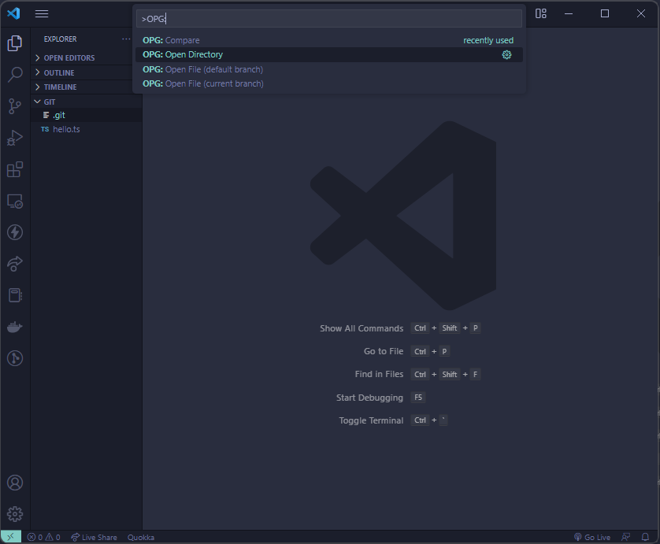

# Open-Git

An extension that opens the current Git remote repository in the browser in a step  
Download extension at https://marketplace.visualstudio.com/items?itemName=ReeteshDooleea.opg

## Commands

1. `OPG: Open Directory` which opens the root directory of the git remote repository
2. `OPG: Open File (master)` which opens the active file in VS Code editor on the _master_ branch
3. `OPG: Open File (current branch)` which opens the active file in VS Code editor on the _current_ branch

Where `OPG` stands for `Open-Git`

## Usage

Run the following commands in your current git directory:

```
Open the Command Palette : Ctrl + Shift + P
Enter the Command        : OPG: Open Directory
```

<br />

Example:


