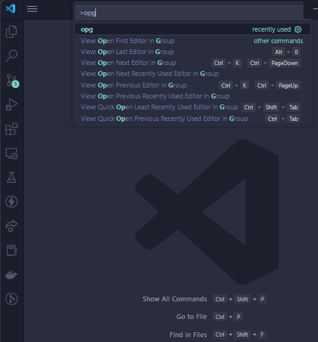

# Open-Git

An extension that opens the current Git remote repository in the browser in two quick steps.

<br />

## How to use

<br />

In your current Git directory:

1. Click on any file within the directory to open it in the text editor
2. Run the following commands:

```
Open the Command Palette : Ctrl + Shift + P
Enter the Command        : opg
```

where `opg` stands for `open git`.

<br />

Example:


